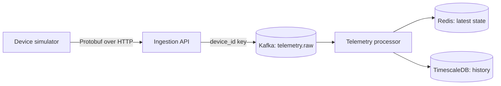

# PulseGrid

A distributed, real-time IoT telemetry pipeline built with FastAPI, Protobuf, Kafka, Redis, and TimescaleDB.

## What it does

PulseGrid receives telemetry from simulated IoT devices, processes it asynchronously, and stores it in two forms:

- **Redis** holds the latest state for fast device lookups.
- **TimescaleDB** retains every metric for historical queries and charts.

## Architecture



## Implemented

- Protobuf telemetry contract and binary HTTP ingestion endpoint
- Kafka topic with three partitions, keyed by `device_id`
- Async Kafka producer and consumer processor
- Redis latest-state storage per tenant and device
- TimescaleDB telemetry history with idempotent inserts
- Device simulator and end-to-end local verification

## Run locally

Requirements: Docker Desktop and Python 3.12+.

```bash
git clone https://github.com/ask-kumbar/PulseGrid.git
cd PulseGrid

python3.12 -m venv .venv
source .venv/bin/activate
pip install --upgrade -e ".[dev]"

docker compose up -d kafka redis timescaledb
```

Create the Kafka topic once:

```bash
docker compose exec kafka /opt/kafka/bin/kafka-topics.sh \
  --bootstrap-server localhost:9092 \
  --create --if-not-exists \
  --topic telemetry.raw \
  --partitions 3 \
  --replication-factor 1
```

Start these in separate terminals:

```bash
uvicorn services.ingestion_api.main:app --reload
```

```bash
python -m services.telemetry_processor.main
```

```bash
python -m services.device_simulator.main
```

## Verify stored telemetry

Latest device state in Redis:

```bash
docker compose exec redis redis-cli --raw GET telemetry:latest:acme:sensor-204 | jq
```

Historical telemetry in TimescaleDB:

```bash
docker compose exec timescaledb psql -U pulsegrid -d pulsegrid -c "SELECT event_id, device_id, metric, value, observed_at FROM telemetry_events ORDER BY observed_at DESC;"
```

## Documentation

For setup details and every command used during development, see [the command guide](docs/command-guide.md).

## Next

Build the query API for latest state and historical telemetry, then add a dashboard.

## License

MIT
