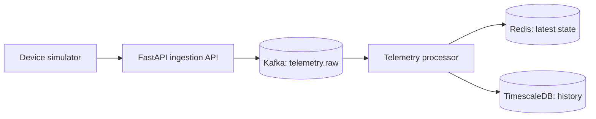

# PulseGrid

**A distributed, real-time IoT telemetry ingestion pipeline built with Kafka, Redis, TimescaleDB, FastAPI, and Protobuf.**

PulseGrid accepts binary telemetry events from devices, publishes them to Kafka, keeps the newest state in Redis, and persists each metric in TimescaleDB for historical analysis.



## Current MVP stage

The core local pipeline is working end to end:

```text
Simulator → FastAPI → Kafka → Processor → Redis + TimescaleDB
```

The next milestone is a query API that reads latest state from Redis and time-range history from TimescaleDB.

## Technology choices

| Component | Role |
|---|---|
| Kafka | Durable, partitioned event stream; replay and consumer scaling |
| Redis | Fast latest-device-state lookups |
| TimescaleDB | Persistent time-series telemetry history |
| FastAPI | Protobuf-over-HTTP ingestion API |
| Python | Simulator and Kafka processor services |
| Protobuf | Compact, typed telemetry event format |

## Event contract

Telemetry uses the `TelemetryEvent` Protobuf message defined in [proto/telemetry.proto](proto/telemetry.proto). It contains an event UUID, tenant ID, device ID, observation time, sequence number, and one or more metrics.

Kafka uses `device_id` as the message key. That keeps one device's events in order while allowing different devices to be distributed across partitions.

## Reliability principles

- Kafka is the durable event stream; Redis is rebuildable latest state.
- Processing is at-least-once: the processor commits the Kafka offset only after both database and Redis writes succeed.
- TimescaleDB inserts are idempotent through the metric history primary key.
- Timestamps are stored in UTC.

## Local development

Install Docker Desktop and Python 3.12+, then follow the copyable commands in [docs/command-guide.md](docs/command-guide.md).

## Planned next steps

- Query API for latest state and telemetry history
- React dashboard
- Dead-letter queue, tests, and observability
- Cloud deployment

## License

MIT
