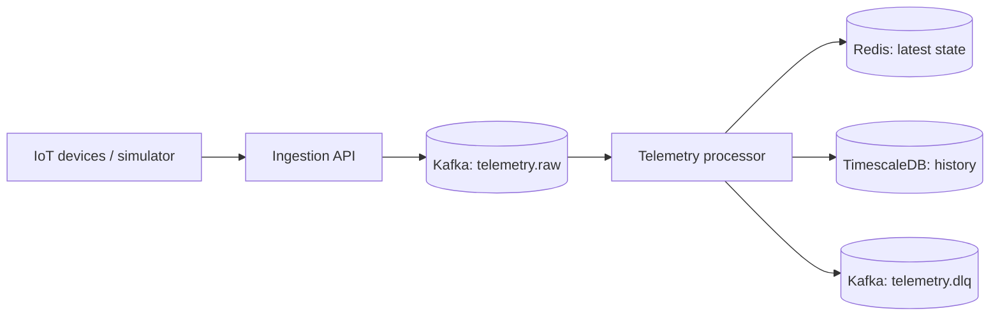

# PulseGrid

**A distributed, real-time IoT telemetry ingestion pipeline built with Kafka, Redis, and TimescaleDB.**

PulseGrid accepts telemetry from connected devices, transports it durably through Kafka, maintains each device's current state in Redis, and stores history in TimescaleDB for analysis.

## Architecture



Kafka topics are logical streams in a single Kafka cluster—not separate Kafka servers.

## Technology choices

| Component | Role |
|---|---|
| Kafka | Durable, partitioned event stream; replay and consumer scaling |
| Redis | Fast current state and alert cache |
| TimescaleDB | Persistent time-series telemetry history |
| FastAPI | HTTP ingestion endpoint and query API |
| Python | Simulator, producer, and processing services |

## Repository layout

```text
services/
  ingestion-api/       # Validates incoming device events and produces to Kafka
  telemetry-processor/ # Kafka consumer; writes Redis + TimescaleDB
  query-api/           # Reads latest state and time-series history
  device-simulator/    # Generates realistic telemetry
infra/timescaledb/     # Database initialization
docs/                  # Architecture and interview notes
```

## Event contract

```json
{
  "eventId": "9c03fa7b-7069-4c47-94ef-4c0d7203120c",
  "deviceId": "sensor-204",
  "tenantId": "acme",
  "timestamp": "2026-09-02T10:15:31.245Z",
  "sequenceNo": 18420,
  "metric": "temperature_c",
  "value": 27.4
}
```

Kafka messages use `deviceId` as the key, preserving event order per device while distributing devices across partitions.

## Local development

Prerequisite: Docker Desktop.

```bash
cp .env.example .env
docker compose up -d
```

This starts Kafka, Redis, and TimescaleDB. Build the application services next, following [the build plan](docs/build-plan.md).

## Reliability principles

- Treat Kafka as the event source of truth; Redis is rebuildable cache/state.
- Use at-least-once consumption and make writes idempotent using `eventId`.
- Send malformed or repeatedly failed records to `telemetry.dlq`.
- Monitor consumer lag, processing latency, DLQ volume, and Redis/database errors.

## License

MIT
